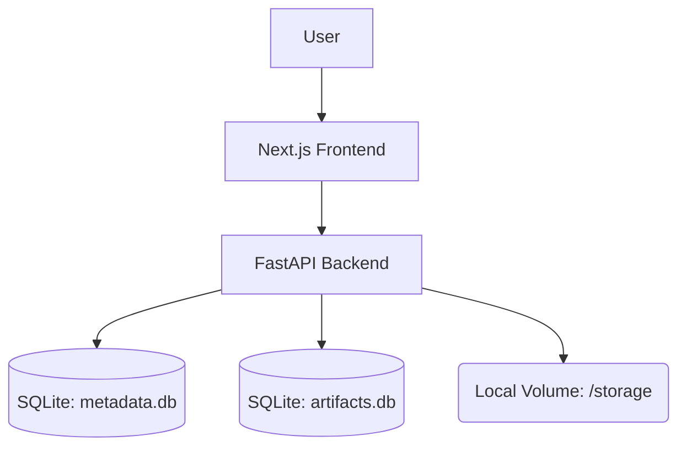

# Architecture Diagram

```mermaid
graph TD;
  User-->Frontend[Next.js Frontend]
  Frontend-->Backend[FastAPI Backend]
  Backend-->MetadataDB[(SQLite: metadata.db)]
  Backend-->ArtifactsDB[(SQLite: artifacts.db)]
  Backend-->Storage(Local Volume: /storage)
```
